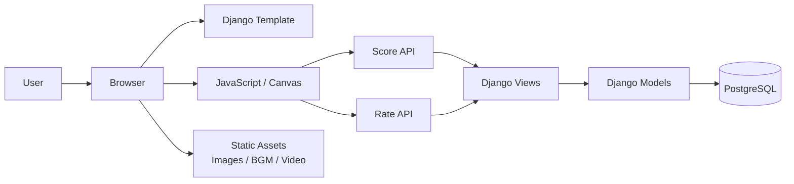
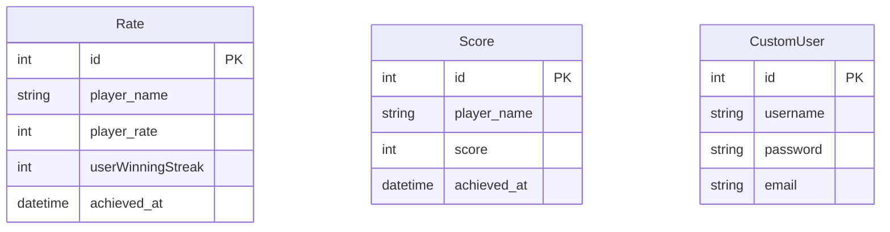

<br />

## 作品概要

**Typing Game**は、CPUとタイピング速度を競うレート制の対戦タイピングゲームです。  
プレイヤーは日本語または英語のお題を入力し、10問中6問以上をCPUより速く正確に入力できると勝利します。

一般的なタイピングゲームでは自動的に入力判定が進むこともありますが、本作品では**日本語の変換や入力ミスの訂正をプレイヤー自身が行う仕様**にしています。  
そのため、単なるキー入力速度だけではなく、実際の文章入力に近いタイピング力を鍛えられる点が特徴です。

また、プレイヤー名に紐づいてレートと連勝数を保存し、対戦結果に応じてレートが変動します。  
「数回遊んで終わる練習ツール」ではなく、継続的に遊びたくなるゲーム性を意識して制作しました。

このゲームは私が学部3回生に授業の一環で作成した制作物です。

<br />

## 制作背景・サービスへの想い

私は、タイピングゲームが好きでありながら、実際の文章入力に近い形で練習できるサービスに物足りなさを感じていました。  
特に日本語入力では、変換・訂正・文節の判断が必要になりますが、既存のタイピングゲームではその部分が簡略化されていることが多くあります。

そこで本作品では、**実践的な入力スキルを鍛えられること**と、**対戦・レートによって継続的に遊べること**を両立させることを目標にしました。  
CPUのレートに応じてタイピング速度を変化させることで、プレイヤーの実力に近い相手と競えるようにし、ゲームとしての達成感を高めています。

Djangoによるバックエンド実装、JavaScriptによるゲームロジック、Canvas APIによる描画、DBを使ったユーザー情報管理を学びました。

<br />

## アプリケーションのイメージ


<br />

## 機能一覧

| スタート画面 | マッチング画面 |
| ---- | ---- |
|  |  |
| 日本語・英語モードを選択し、クリックで対戦を開始します。BGMのON/OFF切り替えにも対応しています。 | プレイヤーとCPUの名前・レート・連勝数を表示し、5秒後に対戦へ移行します。 |

| タイピング対戦画面 | 結果画面 |
| ---- | ---- |
|  |  |
| お題を入力し、正しい文字はグレー、誤った文字は赤で表示します。先に入力完了した側にポイントが入ります。 | 勝敗、レート変動、タイピング速度を表示します。クリックすると再マッチングできます。 |

| レート管理 | 言語切り替え |
| ---- | ---- |
| プレイヤー名ごとにレートと連勝数を保存し、次回プレイ時に取得します。未登録ユーザーは初期レート2000から開始します。 | 日本語モード・英語モードを選択でき、それぞれ約30個のお題からランダムに10題を出題します。 |

<br />

## 使用技術

| Category | Technology Stack |
| --- | --- |
| Frontend | HTML, CSS, JavaScript |
| Game Rendering | Canvas API |
| Backend | Python, Django |
| Database | PostgreSQL |
| Template / UI | Django Template, django-bootstrap5 |
| Static Assets | Image, BGM, Video |
| Version Control | Git, GitHub |

<br />

## システム構成図



<br />

## ER図



<br />

## 主要ロジック

### ゲームフェーズ管理

ゲーム全体を以下のフェーズに分け、状態に応じて描画・入力・遷移処理を切り替えています。

| Phase | 内容 |
| --- | --- |
| 0 | タイトル画面。プレイヤー名、レート、スタートガイドを表示 |
| 1 | マッチング画面。CPU情報を表示し、5秒後に対戦準備へ移行 |
| 2 | カウントダウン画面。対戦開始前のカウントを表示 |
| 3 | タイピング対戦画面。入力判定、CPU入力演出、得点処理を実行 |
| 4 | 結果画面。勝敗、レート変動、タイピング速度を表示 |

### 正誤判定と問題遷移

タイピング中は、入力された文字列と現在のお題を1文字ずつ比較します。  
正しく入力された文字には`typed`クラスを付与し、誤っている文字には`highlight`クラスを付与することで、リアルタイムに視覚的なフィードバックを返します。

全て正しく入力できた場合はプレイヤーのポイント、CPUの入力演出が先に完了した場合はCPUのポイントとして処理します。  
10題終了後、6問以上取得した側を勝者として結果フェーズへ移行します。

### レート・連勝数管理

プレイヤー名を入力すると、Django側で`Rate`テーブルを参照し、既存ユーザーであればレートと連勝数を取得します。  
未登録ユーザーは初期レート2000として扱い、対戦終了後にレートと連勝数を保存・更新します。

CPUはプレイヤーのレートに近い範囲で生成され、CPUレートに応じてタイピング速度を調整します。  
これにより、プレイヤーの実力に近い相手と対戦しているようなゲームバランスを実現しています。

<br />

## 担当範囲

チーム開発の中で、私は主に以下を担当しました。

- `Rate`モデルの定義
- プレイヤー名に紐づくレート・連勝数の取得と更新
- マッチングフェーズの実装
- 対戦結果フェーズの実装
- レート計算ロジック
- CPUレートとタイピング速度のバランス調整

特にデータベース連携は初めて扱う領域だったため、DjangoのModel・View・JavaScript間でどのようにデータを受け渡すかを理解しながら実装しました。  
単に画面上で動くゲームではなく、プレイヤー情報を保存し、次回プレイに反映できるWebアプリケーションとして成立させることを意識しました。

<br />

## セットアップ

```bash
python -m venv .venv
source .venv/bin/activate
pip install -r requirements.txt
```

<br />

## 環境変数

```bash
export DJANGO_SECRET_KEY='任意の秘密鍵'
export DB_USER='PostgreSQLのユーザー名'
export DB_PASSWORD='PostgreSQLのパスワード'
```

<br />

## 起動方法

```bash
python manage.py migrate
python manage.py runserver
```

起動後、以下のURLにアクセスします。

```text
http://127.0.0.1:8000/
```

<br />

## 今後の展望

- **リアルタイム対戦機能**  
  現在はCPU対戦のため、WebSocketを用いて実ユーザー同士で対戦できる機能を追加したいです。

- **ランキング機能**  
  レート上位者を表示し、継続プレイの動機をさらに高めたいです。

- **報酬要素の追加**  
  達成レートに応じてアイコンや称号を解放するなど、ゲームに直接影響しない報酬を追加したいです。

- **レスポンシブ対応**  
  画面サイズに応じてCanvasや入力欄を調整し、より多くの環境で遊べるようにしたいです。

- **コード品質の改善**  
  JavaScriptの責務分離、テストコード追加、APIエラーハンドリング強化を進めたいです。

<br />

## 画像について

READMEで使用している画像は、`docs/img/`配下に配置しています。  
画面キャプチャを差し替える場合は、同じファイル名で上書きするとREADME側のリンクを変更せずに更新できます。

<br />

## 参考文献・外部リソース

- BGM: https://www.loopbgm.com/works/archives/129
- キャラクターアイコン: https://miso33.com/category/freeicon/
- レート計算参考: https://puyo-camp.jp/posts/85999
